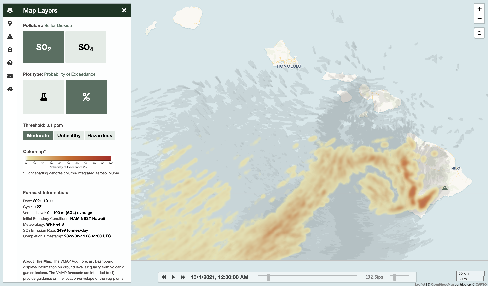

VogCast Documentation
====================================

.. note::

   This documentation page is currently under development.

VogCast is an open-source volcanic air pollution modelling framework developed by the Vog Measurement and Prediction Program (VMAP) at the University of Hawaii at Manoa. It combines multiple existing models and data streams into a flexible unified workflow to create surface and column-integrated air quality forecasts for SO2 and SO4. VogCast is designed for deployment on an HPC system. 

Operational forecasts produced by the VogCast modelling framework for the State of Hawai'i can be found here:
http://weather.hawaii.edu/vmap/new/

Scientific background and details of model development can be found in:
[link to be inserted post-submission]

.. toctree::
   :maxdepth: 2
   :caption: Contents:

   
   ./modules
   ./requirements
   ./setup
   ./workflow
   ./graphics

Indices and tables
==================

* :ref:`genindex`
* :ref:`modindex`
* :ref:`search`
